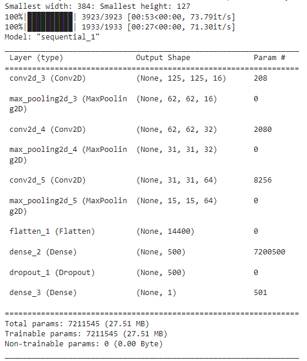

# WCRAI - Wilhelm Conrad Röntgen Artificial Intelligence for Pneumonia Detection

## Introduction
WCRAI, standing for Wilhelm Conrad Röntgen Artificial Intelligence, is an endeavor to revolutionize the detection and classification of pneumonia from X-ray images using state-of-the-art AI. This project is dedicated to the improvement of diagnostic accuracy, reduction of diagnosis time, and support in clinical decision-making through advanced machine learning techniques.

## Project Goals
The project aims to refine AI algorithms for identifying pneumonia, speeding up the diagnostic process, and integrating the system into the existing radiological workflow, democratizing quality diagnosis, especially in regions with a shortage of specialists.

## Ressources
For this project, 5.388 lung X-ray images were used, obtained from the following database: https://www.kaggle.com/datasets/paultimothymooney/chest-xray-pneumonia

The images were previously checked, processed, and labeled for the project.

## Methodology
Our methodology encompasses meticulous data selection and preparation, image processing to optimize model training, and a systematic approach to train the algorithm in phases. The robust user interface developed with Tkinter facilitates interaction with the system and displays diagnostic information in an accessible format.

## Model Development
The development of the WCRAI algorithm involved technology selection, data preprocessing, model programming, and training. A two-phased approach was employed to first differentiate between 'non-pneumonia' and 'pneumonia', followed by the classification of 'pneumonia' into 'viral' and 'bacterial'.

## Results
The AI model showcases high accuracy in detecting pneumonia with a reliable confusion matrix, demonstrating a true positive rate of 0.91% for 'no pneumonia' and 0.97% for 'pneumonia'. In the differentiation between 'bacterial pneumonia' (0.65%) and 'viral pneumonia' (0.81%), the model maintains superior performance.

## Clinical Implementation
Implementation stages include system integration, staff training, and continuous support. Rigorous clinical studies and adherence to standards and regulations like HIPAA underscore our commitment to ethical innovation.

## Future Vision and Expansion Potential
Looking forward, WCRAI envisions an expansion to other pathologies, integration of multimodal data, and development of predictive analytics, maintaining an active role in research and development to stay at the forefront of medical technology.

## Challenges and Solutions
The project has successfully navigated challenges such as image quality variability, data integration, overfitting, and adoption by medical professionals by implementing rigorous preprocessing, collaboration with PACS and EMR, and educational workshops.

## Future Steps
Future directions include expanding the dataset, updating the algorithm, integrating clinical feedback, and developing explanatory AI features to enhance user trust in the system.

## Contact and References
For more information about the WCRAI project, please contact:
Juan García
CEO AI Expert & AI Manager
SMART &PRO AI Services
info@smartandpro.de
Tel.: (+49) 162 5371628
Laufenburg (Germany)

Refer to extern publication for an in-depth understanding:
Gupta, A., Sheth, P., & Xie, P. (2022). Neural architecture search for pneumonia diagnosis from chest X-rays. [DOI](https://doi.org/10.1038/s41598-022-15341-0)

## Acknowledgments
We extend our gratitude to all those involved in the WCRAI project, including researchers, healthcare professionals, and contributors from the tech community.

# Model 1: Pneumonia Detection

The first model focuses on distinguishing X-ray images with pneumonia from those without it.

## Code explanation
Copyright (c) 2023, SMART &PRO AI Services - Juan García

All rights reserved.

The code and associated documentation files (the "Software") are the intellectual property of SMART &PRO AI Services and are protected under applicable copyright laws. This Software is solely for educational and research purposes. Any use of the Software for commercial purposes, including but not limited to the reproduction, distribution, display, or performance of the Software, or the use of the Software to create derivative works, is strictly prohibited without the prior written consent of SMART &PRO AI Services (Juan García).

By downloading, cloning, or using the Software, you agree to abide by the terms of this notice. Unauthorized use, modification, or sharing of the Software is a violation of copyright laws and may result in legal action.

## Importing necessary libraries
```python
import numpy as np
import os
from sklearn.model_selection import train_test_split
from keras.preprocessing import image
from tensorflow.python.keras.callbacks import EarlyStopping
from tqdm import tqdm
import tensorflow as tf
import matplotlib.pyplot as plt
from sklearn.metrics import confusion_matrix
```

## Function to collect images and label them for the dataset
```python
def collect_images(path,target):
    images_list = []
    target_list = []
    target = target
    for r, d, f in os.walk(path):
        for file in f:
            if ('.jpeg' in file):
                images_list.append(os.path.join(r, file))
                target_list.append(target)

    features =np.transpose([np.array(images_list)])
    labels = np.transpose([np.array(target_list)])

    return features,labels

def convert_img(img_path):
    # loads RGB image as PIL.Image.Image type
    img = image.load_img(img_path, target_size=(125, 125))
    # convert PIL.Image.Image type to 3D tensor with shape (40, 40, 3)
    x = image.img_to_array(img)
    # convert 3D tensor to 4D tensor with shape (1, 40, 40, 3) and return 4D tensor
    exp_array = np.expand_dims(x, axis=0)
    return exp_array.astype('float32')/255

def paths_to_images(images):
    list_of_images = [convert_img(img_path) for img_path in tqdm(images)]
    return np.vstack(list_of_images)

def find_smallest_dimension():
    #high unrealistic initial values
    width = 10000
    height = 10000
    for i in range(len(features)):
        path = features[i,0]
        img = image.load_img(path)
        tmp_width, tmp_height = img.size

        if tmp_width < width:
            width = tmp_width
        if tmp_height < height:
            height = tmp_height

    print("Smallest width: %d: Smallest height: %d" %(width,height))
```

## Data collection and preparation
```python
normal_path = "/content/drive/My Drive/data2/not_infected"
ill_path = "/content/drive/My Drive/data2/infected"

normal_X,  normal_Y= collect_images(normal_path,target=0)
ill_X,ill_Y = collect_images(ill_path,target=1)

features = np.concatenate((normal_X,ill_X),axis=0)
labels = np.concatenate((normal_Y,ill_Y),axis=0)

find_smallest_dimension()

X_train, X_test, y_train, y_test = train_test_split(features, labels, test_size=0.33, random_state=42)

train_tensor = paths_to_images(X_train.flatten())
test_tensor = paths_to_images(X_test.flatten())
```

## Model construction with convolutional and pooling layers
```python
model = tf.keras.models.Sequential([
        tf.keras.layers.Conv2D(16,kernel_size=2,strides=1,padding='same', activation='relu', input_shape=train_tensor.shape[1:]),
        tf.keras.layers.MaxPool2D(pool_size=(2,2),strides=2),
        tf.keras.layers.Conv2D(32,kernel_size=2,strides=1,padding='same', activation='relu'),
        tf.keras.layers.MaxPool2D(pool_size=(2,2),strides=2),
        tf.keras.layers.Conv2D(64,kernel_size=2,strides=1,padding='same', activation='relu'),
        tf.keras.layers.MaxPool2D(pool_size=(2,2),strides=2),
        tf.keras.layers.Flatten(),
        tf.keras.layers.Dense(500, activation='relu'),
        tf.keras.layers.Dropout(0.3),
        tf.keras.layers.Dense(1, activation='sigmoid')])

model.summary()
])
```



## Compile and train the model
```python
model.compile(optimizer='adam',
              loss='binary_crossentropy',
              metrics=[tf.keras.metrics.Recall(name='recall'), 'accuracy'])
early_stopping_monitor = EarlyStopping(
    monitor='loss',
    min_delta=0,
    patience=10,
    verbose=0,
    mode='auto',
    baseline=None,
    restore_best_weights=True
)

history = model.fit(train_tensor,
                    y_train.flatten(),
                    callbacks=[early_stopping_monitor],
                    epochs=100,
                    verbose=2)
```

## Evaluate the model
```python
eval_results = model.evaluate(test_tensor, y_test.flatten(), verbose=2)
```

## Plot training loss and accuracy
```python
loss = history.history['loss']
rec = history.history['recall']
acc = history.history['accuracy']

epochs = range(1, len(loss) + 1)

fig_SI = plt.figure()

ax1_SI = fig_SI.add_subplot(111)

ax1_SI.plot(epochs, loss, 'g.', label='Training loss')
ax1_SI.plot(epochs, rec, 'b.', label='recall')
ax1_SI.plot(epochs, acc, 'r.', label='accuracy')

fig_SI.suptitle('Training loss and accuracy')
ax1_SI.set_xlabel('Epochs')
ax1_SI.legend()
fig_SI.show()
```

## Visualize confusion matrix
```python
def visualize_confusion(conf_matrix, name):
    # normalize values
    normalized_conf_matrix = conf_matrix / conf_matrix.sum(axis=1)[:, np.newaxis]

    conf_figure, ax = plt.subplots(figsize=(7.5, 7.5))

    ax.matshow(normalized_conf_matrix, cmap=plt.cm.BuPu)
    for i in range(normalized_conf_matrix.shape[0]):
        for j in range(normalized_conf_matrix.shape[1]):
            ax.text(x=j, y=i, s=round(normalized_conf_matrix[i, j], 2), va='center', ha='center', size='xx-large')

    conf_figure.suptitle('Confusion matrix')
    tick_marks = np.arange(len(conf_matrix))
    ax.set_xticks(tick_marks)
    ax.set_xticklabels(['no_pneumonia', 'pneumonia'])
    ax.set_yticklabels(['no_pneumonia', 'pneumonia'])
    ax.set_yticks(tick_marks)
    ax.set_ylabel('True label')
    ax.set_xlabel('Predicted label')

    filename = name + '_Confusion_matrix'

    conf_figure.savefig(filename, bbox_inches='tight')
    plt.show()

    return normalized_conf_matrix[1, 1]
```

## Predict and calculate true positive rate
```python
prediction = model.predict(test_tensor)
rounded_prediction = tf.math.round(prediction)
# create a confusion matrix
conf_matrix = confusion_matrix(y_true=y_test.flatten(), y_pred=rounded_prediction)
keras_name = 'pneumonia'
tpr = visualize_confusion(conf_matrix,keras_name)

print('The accuracy is: ' +'{:.1%}'.format(eval_results[2]))
print('The true positive rate is: ' +'{:.1%}'.format(tpr))
```

## Results for Model 1
The model achieved an accuracy of 95.3% and a true positive rate of 97.0%. The confusion matrix and training graphs provide insight into the model's performance throughout the training process.


# Model 2
Same as model 2, but with diferent labels.

Results for Model 2:

The model distinguished between bacterial and viral pneumonia with an accuracy of 75.3% and a true positive rate of 64.6%. Visualizations of the confusion matrix and accuracy over epochs illustrate the model's effectiveness.


# Conclusion and Future Work
The WCRAI initiative represents a significant step towards the application of AI in radiodiagnosis. With the successful development and evaluation of these models, we are paving the way for enhanced diagnostic capabilities and broader applications in medical imaging. The future of WCRAI includes expanding the dataset, refining the algorithms with the latest machine learning techniques, and integrating user feedback to continuously improve the system's performance and usability. We aim to develop features that provide explanations of the algorithm's decisions, fostering trust and transparency in AI-assisted medical diagnosis. Collaborations with medical institutions and continuous research will be instrumental in pushing the boundaries of what AI can achieve in healthcare.

# For further inquiries and contributions, please reach out to the project lead:

  **Juan García**  
  CEO, AI Expert & AI Manager  
  SMART &PRO AI Services
  Email: info@smartandpro.de  
  Tel.: (+49) 162 5371628  
  Mauchen (Germany)  

Stay connected and follow our progress on LinkedIn and our website for the latest updates and developments. Your feedback and participation are invaluable to the evolution and success of WCRAI.

LinkedIn: [Juan García](https://www.linkedin.com/in/juan-garcia-b1451729a)  
Website: [SMART &PRO AI Services](https://smartandpro.de)
